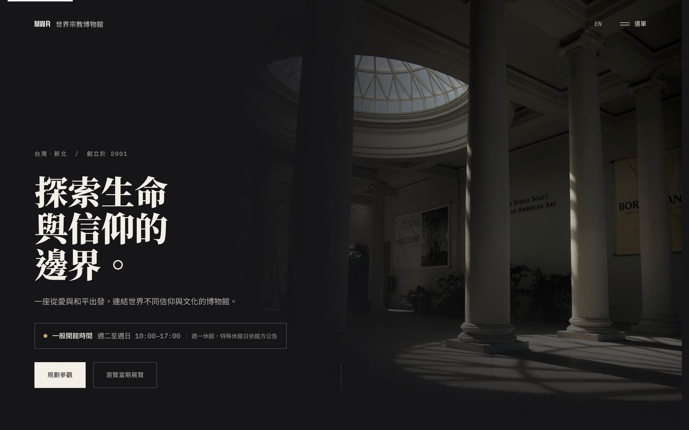
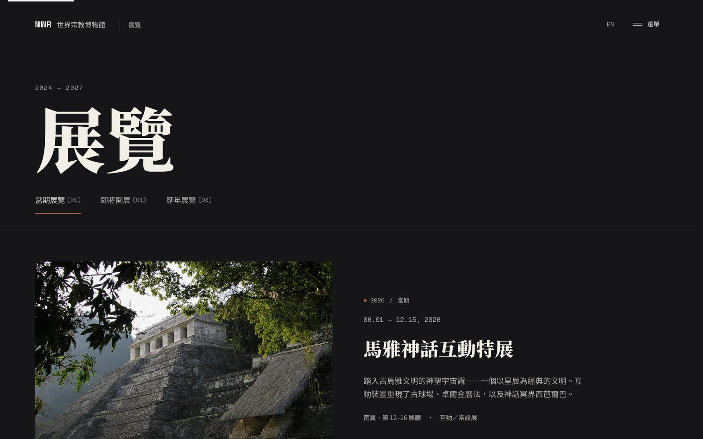
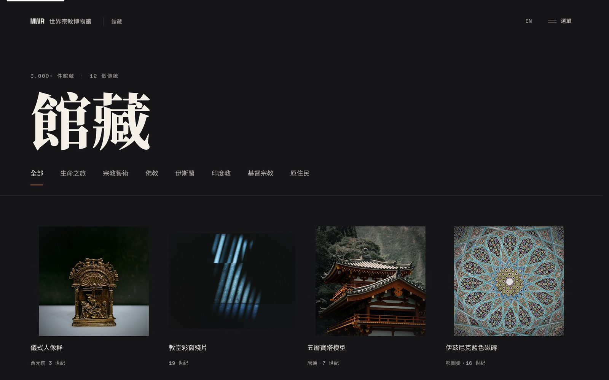

# MWR 世界宗教博物館 (Museum of World Religions — Redesign)

Live Demo: https://russell06-web.github.io/mwr-museum-redesign/
Case Study: https://russell06-web.github.io/projects/mwr-museum.html

## Overview

虛構的世界宗教博物館網站，把一份靜態的 Figma Make 概念稿實作成具備真實互動、雙語切換與無障礙支援的完整多頁網站。

## My Role

UI/UX Concept Design、Interaction Design、Front-End Implementation（個人練習專案，起點為 Figma Make 概念稿）

## Key UX Focus

- 全螢幕導覽疊層取代分散的多層選單，降低多頁式架構的迷路風險
- 動效服務內容而不搶戲：呼吸感背景、灰階轉全彩揭露皆保留但克制
- 深色介面的文字與互動元件對比度另外檢查，不因氛圍犧牲可讀性
- 雙語（中／英）切換與鍵盤操作的一致性
- 拖曳式虛擬導覽輪播，貼近實際導覽瀏覽行為

## Features

- 9 個完整頁面：首頁、展覽（當期／即將／歷年頁籤）、館藏（分類篩選）、關於、5 個訪客服務頁
- 全螢幕導覽疊層（分類與子選單、照片同步切換）
- 拖曳式虛擬導覽輪播
- 灰階轉全彩的圖片捲動揭露效果
- EN／中 雙語切換
- 深色介面的鍵盤操作與 WCAG AA 對比度補強

## Validation

虛構機構、練習性質專案，沒有真人使用者測試資源。驗證聚焦在自我檢核：逐一比對 Figma Make 原始碼與畫面稿確認互動意圖，並用 Playwright 逐頁檢查零 console error、零版面溢出、導覽疊層開關與鍵盤操作是否正常，人工核對深色文字與互動元件對比度是否符合 WCAG AA。

## Limitations

虛構機構，練習性質專案，沒有真實使用者訪談或營運資料。館名、圖片與相關內容之權利歸原權利人所有，本站僅為個人作品集概念設計，非世界宗教博物館官方網站。

## Tech Stack

HTML、CSS、JavaScript（無框架）、Figma Make、Claude Code

## Screenshots

